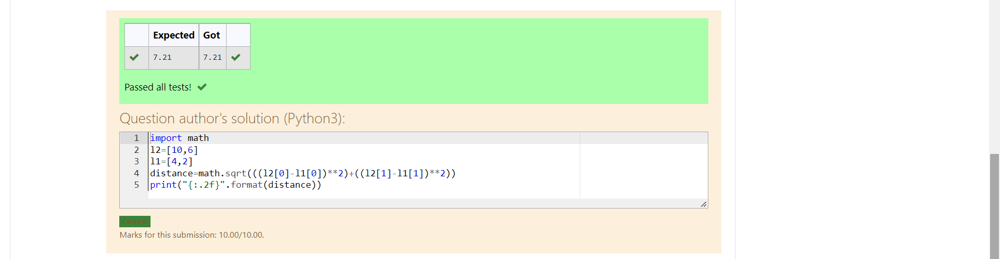

# DISTANCE-BETWEEN-TWO-POINTS

## AIM:
To write a python program to find the distance two 2 points
## ALGORITHM:
### Step 1: 
### Step 2: 
### Step 3: 
Substitute the values in the distance formula  
 
### PROGRAM:
```
x1=10
y1=6
x2=4
y2=2
d=round(((x2-x1)**2+(y2-y1)**2)**0.5,2)
print(d)
```
  


### OUTPUT:



### RESULT:
The Program is executwed successfully
